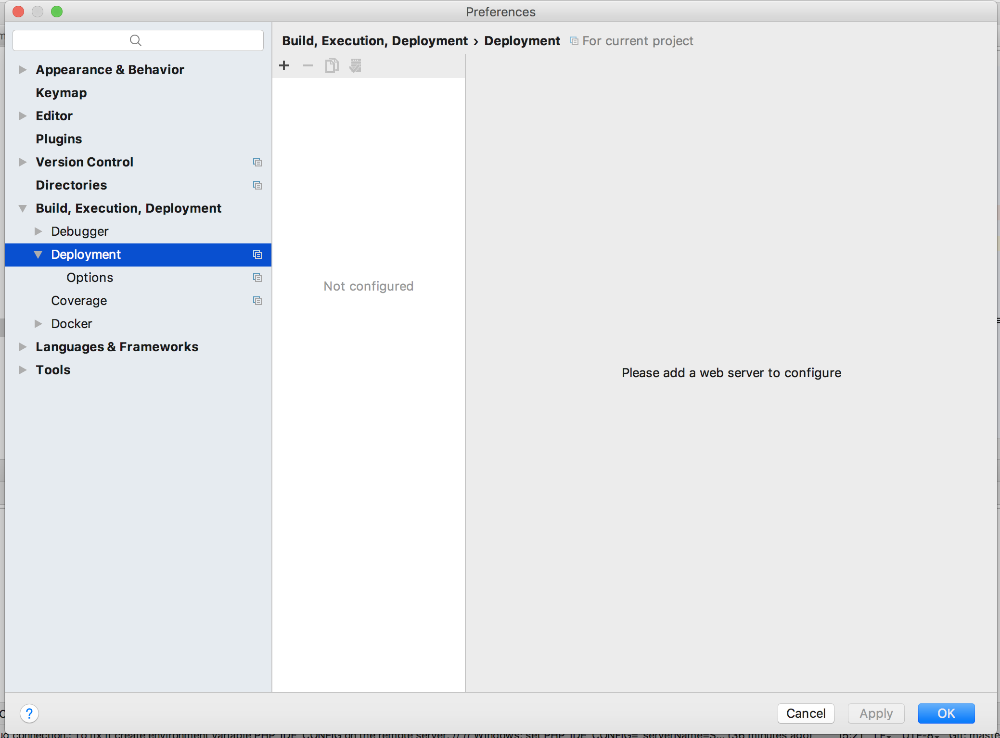
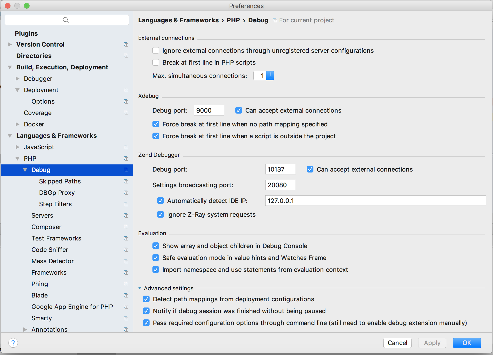
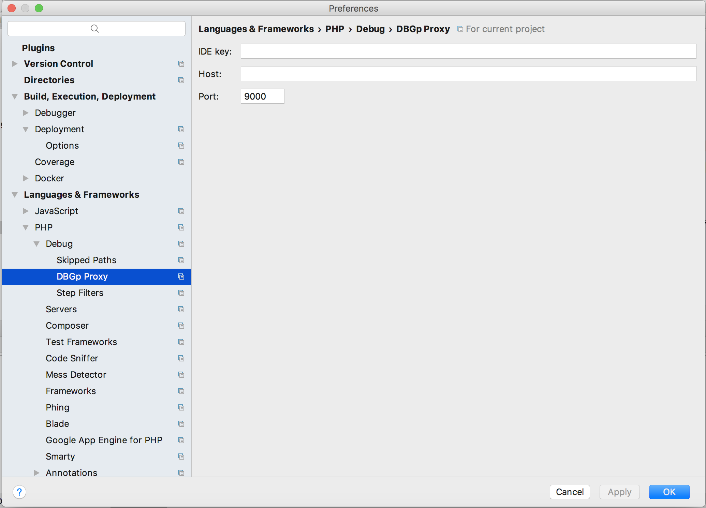
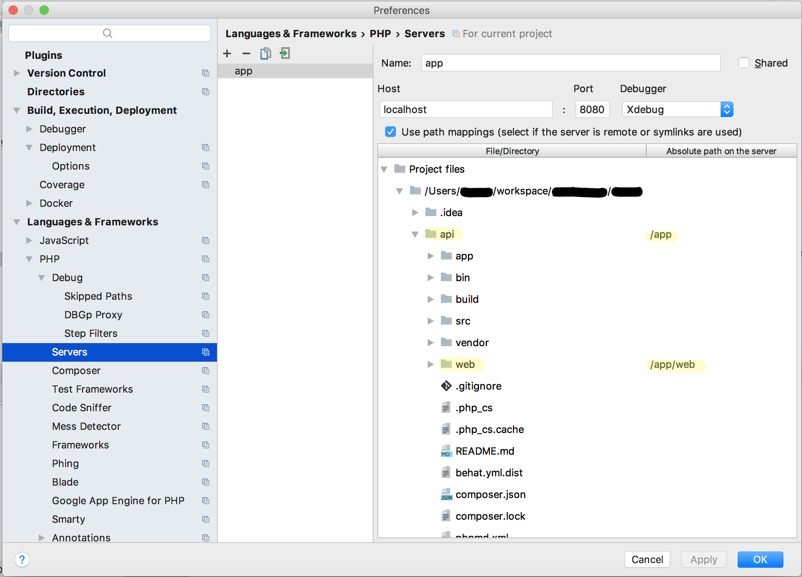
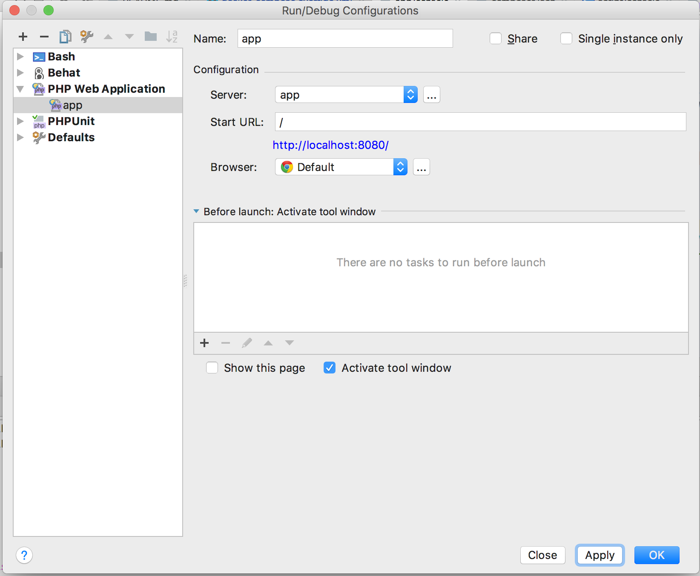

# dreadlabs/php-symfony

## Description

Docker images for developing and running Symfony web applications.

### Flavours

  - `base`: base image for Symfony applications, ready for production usage
  - `dev`: image for development of Symfony applications, containing:
    - Symfony installer
    - Composer
    - `php-dbg`, custom command line wrapper for debugging in PhpStorm
    - `php-prof`, custom command line wrapepr for generating XDebug profiling snapshots (Cachegrind)

### Version schema

The version schema reflects the PHP version used as the runtime environment.

### "Poor man's service discovery"

The images include Nginx configurations adjusted to work for the PHP / Symfony applications they will contain. This
approach was chosen in order to use a generic Nginx image. It works in Docker Compose environments, but may fail in
Docker Swarm environments (untested) because of its distributed nature (no startup order, volume sharing).

A major drawback of this approach: when updating the configuration file you need to stop and remove the connected
services in order to re-write the upated configuration file to the exchange volume.

**How it works**:

For an example please view the [`docker-compose.yml.dist`](7.0/dev/docker-compose.override.yml.dist) of the `dev` flavour.

  1. define a volume `app-nginx` to exchange the Nginx configuration file for the runtime environment (PHP, Symfony)
  2. this volume is mounted to the `app` service, which will then distribute the shipped configuration file on startup
     to that volume
  3. this volume is also mounted to the `nginx` service, effectively closing the exchange circle
  4. the `nginx` service is marked as being dependent on the `app` service to ensure the file is written before mounting
     the volume for itself

## Makefile

Tested with GNU Make 3.81. `FLAVOUR` environment variable defaults to `base`.

### List available versions to build

    > make versions-avail
    < 7.0/

### Build

    make build -e VERSION=x.y [FLAVOUR=base|dev]

### Release

    make release -e VERSION=x.y [FLAVOUR=base|dev]

## How tos

### How to modify `app_dev.php` to be accessible in the development image?

Please note: the Docker image `dreadlabs/php-symfony:x.y-dev` **MUST** only be used in development contexts. To allow 
access to Symfony's `app_dev.php` front controller, it will populate the custom FastCGI parameter `X_ALLOW_DEBUG` with 
the value `yes` to the `php-fpm`/FastCGI server.

You should adjust the `app_dev.php` the following way in order to grant access in the context of this setup:

Default:

    if (isset($_SERVER['HTTP_CLIENT_IP'])
        || isset($_SERVER['HTTP_X_FORWARDED_FOR'])
        || !(in_array(@$_SERVER['REMOTE_ADDR'], array('127.0.0.1', '::1')) || php_sapi_name() === 'cli-server')
    ) {
        header('HTTP/1.0 403 Forbidden');
        exit('You are not allowed to access this file. Check '.basename(__FILE__).' for more information.');
    }

New:

    if (!(@$_SERVER['X_ALLOW_DEBUG'] === 'yes')
        && (isset($_SERVER['HTTP_CLIENT_IP'])
        || isset($_SERVER['HTTP_X_FORWARDED_FOR'])
        || !(in_array(@$_SERVER['REMOTE_ADDR'], array('127.0.0.1', '::1')) || php_sapi_name() === 'cli-server'))
    ) {
        header('HTTP/1.0 403 Forbidden');
        exit('You are not allowed to access this file. Check '.basename(__FILE__).' for more information.');
    }

### How to setup debugging for the `dev` flavour?

The setup was tested with PhpStorm 2017.2.4. Please have a look at the following screenshots and setup your IDE accordingly.

#### Build, Execution, Deployment / Deployment

No deployment setup is necessary for debugging.

#### Languages & Frameworks / PHP / Debug

**Note**: I left out the upper part "Pre-Configuration" as it serves informational purposes only.

No special configuration here. If I remember correctly, these settings match the standard configuration for new PHP projects.

#### Languages & Frameworks / PHP / Debug / DBGp Proxy

Some tutorials mentioned to configure this in a certain way. But this is not necessary if you're not going to use a DBGp Proxy.

#### Languages & Frameworks / PHP / Servers

This part is very important to be machted against the `PHP_IDE_CONFIG` setting within the container.

Create a new configuration, named `app`. Set up the path mappings accordingly. In this example, I created a project, containing
multiple applications (`api`, `auth`, ...). The directory `api` contains a Symfony application. In most cases, the contents of
this directory will reside in the root of the PhpStorm project.

Map the application's root directory to `/app` and additionally (may be not necessary) map the application's `web` directory
to `/app/web`.

#### Run configuration

In order to run (`^ R`) or debug (`^ D`) the application on demand, I suggest to create a configuration for it:
Select from menu `Run` / `Edit configurations`. Hit the upper left `+`-Icon and select `PHP Web Application`.

### How to run XDebug for commandline debugging?

First, setup PhpStorm according to: [How to setup debugging for the `dev` flavour?](#howto_debugging_setup).

Then click on the icon named "Start Listening for PHP Debug Connections". To run the application console with 
debugging capabilities, simply prefix the `app/console` command with `php-dbg`:

    php-dbg app/console

### How to generate a XDebug profiling snapshot for a commandline session?

First, setup PhpStorm according to: [How to setup debugging for the `dev` flavour?](#howto_debugging_setup).

Then run:

    php-prof app/console

The snapshot is stored in `/tmp` in the running Docker container.

## Notes

  - Xdebug is currently only working on Docker for Mac 17.06+
    - see [I want to connect from a container to a service on the host][docker_for_mac_host_dns]
  - see [Discovering Docker’s IP Address][che_eclipse] for probably universal Docker host name/IP resolving

## License

[MIT](LICENSE)

[docker_for_mac_host_dns]: https://docs.docker.com/docker-for-mac/networking/#i-want-to-connect-from-a-container-to-a-service-on-the-host
[che_eclipse]: https://che.eclipse.org/discovering-dockers-ip-address-2bb524b0cb28
